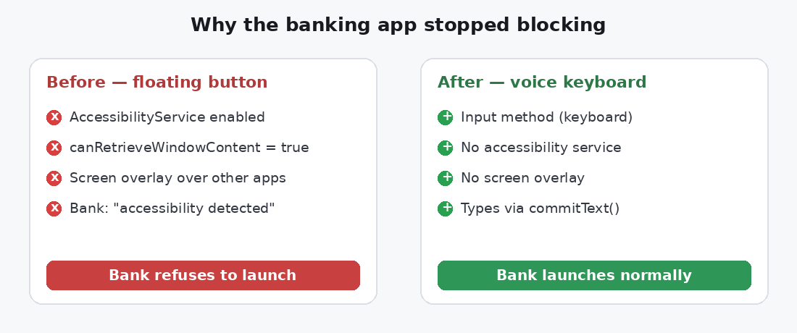
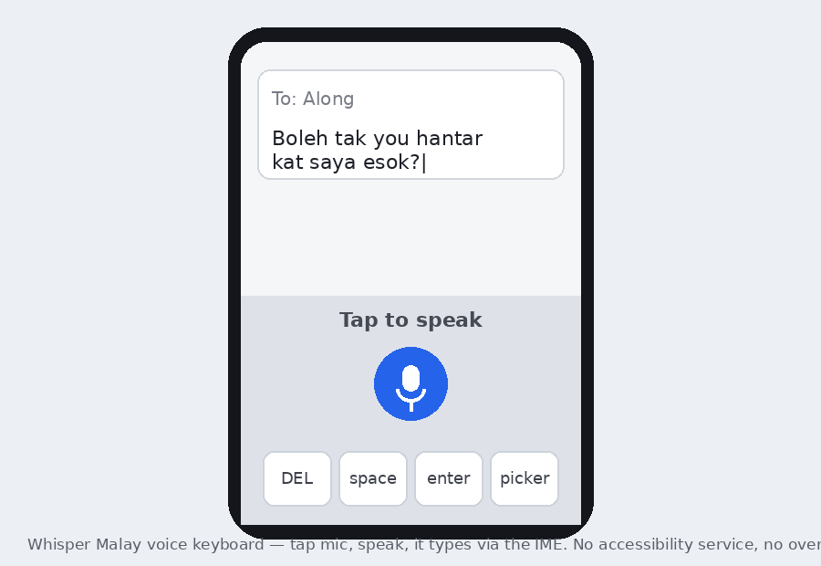
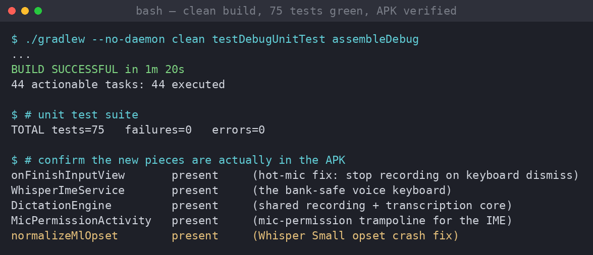

# My dictation app was blocking my banking apps. So I rebuilt how it types.

*2026-07-01 — building Whisper Malay*

Whisper Malay is my little push-to-talk dictation app: tap a floating button, speak
Bahasa Melayu, and the text drops into whatever app you're in. It worked great —
right up until I tried to open my banking app one morning and it flat-out refused:

> *"An accessibility service is active. For your security, close it to continue."*

My own app was the accessibility service. To get into my bank, I had to go into
Settings and turn Whisper Malay off. Every single time. That's not a dictation app —
that's a chore with a microphone.

This is the story of why that happens, why the obvious fixes don't work, and the
re-architecture that finally made the two coexist.

## Why banks block it (and why it's *my* app's fault)

Whisper Malay's magic came from two Android features:

1. An **AccessibilityService** with `canRetrieveWindowContent="true"` — that's how it
   read the focused text field and injected the transcription.
2. A **floating overlay button** drawn on top of every app.

Those two capabilities are also exactly what screen-reading malware uses to steal
OTPs and tap "Confirm" on fraudulent transfers. So Malaysian banks — following Bank
Negara's anti-scam push — now refuse to run while *any* accessibility service that
can read the screen is enabled. They're not wrong to. My app looked, to the bank,
indistinguishable from the thing it's defending against.



## The fixes that *don't* work

My first instinct was to make the app "get out of the way" — detect when a banking
app opens and hide the overlay. I dug into it and hit a wall: **the bank checks at
its own launch.** By the time my app could react to the bank opening, the bank has
already seen the enabled accessibility service and bailed. Hiding the overlay after
the fact changes nothing.

I could also have tried to *hide* the service from detection. I want to be clear that
I deliberately didn't. Fighting a bank's fraud detection is both wrong and a losing
game — and it would make my app behave exactly like the malware the check exists to
stop. The right move isn't to evade the security. It's to stop needing the dangerous
capability at all.

## The rebuild: a voice keyboard

Here's the insight that fixed it: **banks don't block keyboards.** They can't — you
need a keyboard to type. A keyboard that happens to have a microphone and types what
you say is just… a keyboard. Gboard's voice typing works inside banking apps for
exactly this reason.

So I turned Whisper Malay's dictation into an **input method (IME)**: a voice-only
keyboard. You switch to it, tap the mic, speak, and it types the result straight into
the field with `InputConnection.commitText()`. No accessibility service. No overlay.
Nothing for the bank to flag.



I kept it deliberately minimal — a mic button, backspace, space, enter, and the
keyboard-switch key. It's not trying to replace your typing keyboard; you flip to it
just to dictate, then flip back. One job, done well.

The old floating button didn't get deleted — it's still there as an optional "power
mode" for people who want dictate-anywhere and don't mind toggling it off before
banking. But it's off by default and clearly labelled with the banking warning, so a
fresh install is bank-safe out of the box.

## How it's built (and why the refactor mattered)

The recording and transcription logic used to live tangled inside the 700-line
accessibility service. Before I could add a second front-end, I pulled all of it —
microphone capture, the IDLE→RECORDING→TRANSCRIBING state machine, local (on-device)
and cloud transcription, the Malay cleanup pass — out into one shared, UI-free
`DictationEngine`. The accessibility service and the new keyboard are now just two
thin skins over the same core:

```kotlin
// The keyboard: speak -> type. That's the whole integration.
override fun onResult(text: String) {
    handler.post { currentInputConnection?.commitText(text, 1) }
}
```

That refactor deleted ~270 lines from the service and, as a bonus, made the tricky
bits unit-testable for the first time.

## Tested and stable

I build and verify on a machine with no phone attached, so I lean hard on automated
gates. Clean build from scratch, full unit suite, and a check that the new pieces
actually made it into the APK:



I also ran the whole branch past an independent review pass before calling it done —
and it earned its keep. It caught a genuine bug I'd have shipped: if you tapped the
mic and then dismissed the keyboard *without* tapping stop, the microphone stayed
live in the background. An IME's `onDestroy` doesn't fire on a simple hide, so the
recorder never stopped — a hot mic and a growing buffer. The fix was a few lines:

```kotlin
override fun onFinishInputView(finishingInput: Boolean) {
    if (engine.state != DictationEngine.State.IDLE) engine.cancel()
    super.onFinishInputView(finishingInput)
}
```

That's exactly the kind of thing you want a second set of eyes to find before your
users do.

## Honest status

What's proven: the app builds clean, 75 unit tests pass, and the keyboard, shared
engine, permission flow, and fixes are all confirmed present in the APK. The
re-architecture is done and the dangerous capability is gone from the default path.

What still needs a phone: I can't drive an Android keyboard headless, so the final
mile is on-device — install, enable the Whisper keyboard, dictate into a chat app,
and then confirm the banking app opens normally with the accessibility service off.
That's the last box to tick, and it's the one that matters most to me, because it's
the whole reason I did this.

## What I took away

- **When your app trips a security control, the fix is usually to need less power, not
  to argue with the control.** The bank was right; my mechanism was the problem.
- **A hard "no" from the platform is a design brief.** "You can't have an accessibility
  service near a bank" pointed straight at "so don't use one — use a keyboard."
- **Extract the core before you add the second thing.** One shared `DictationEngine`
  turned a scary second front-end into a thin skin.

The floating button was clever. A keyboard that just types what I say, and never
makes me choose between dictation and my bank, is better.
