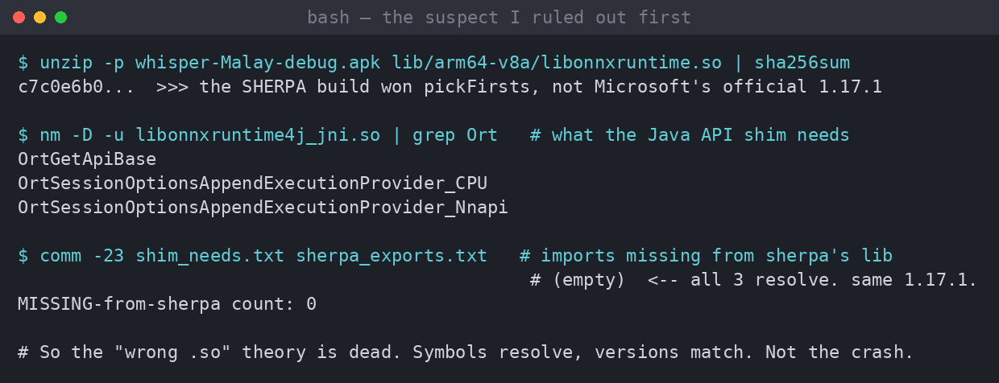
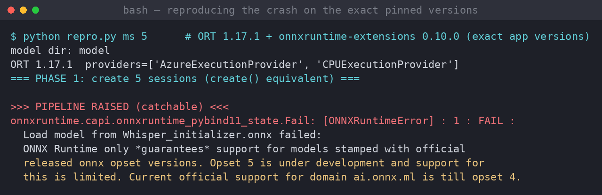
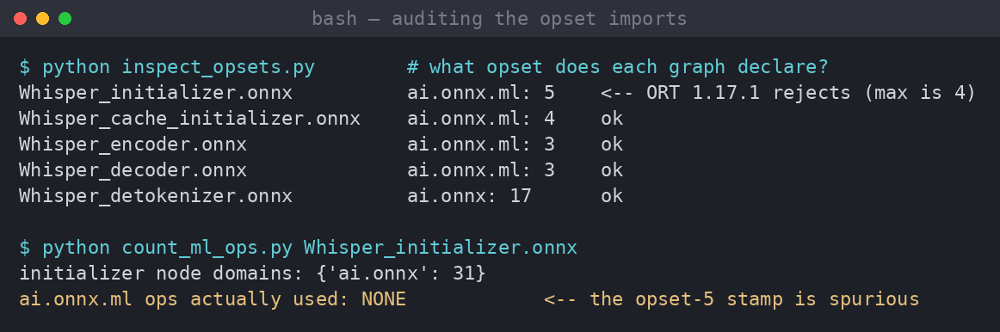
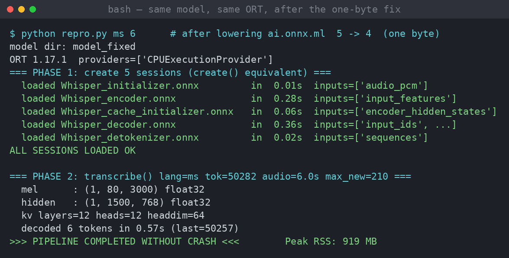

# The one-byte bug: why "Whisper Small Multilingual" crashed my dictation app

*2026-07-01 — debugging notes from the Whisper Malay fork*

Every other model in my app worked. Parakeet, the sherpa Whisper builds, Moonshine —
all fine. But the moment I picked **Whisper Small Multilingual**, the thing fell over.
No transcription, just a dead model and an app that gave up.

I didn't have my S24 Ultra tethered to a laptop when I started poking at this, and I
couldn't run the app on my dev box either — it's `arm64-v8a` only, and the native libs
that matter here won't load on an x86 emulator. So this is the story of tracking down a
crash I *couldn't run*, by being stubborn about reproducing it the right way. It ends on
a fix that changes exactly **one byte** of the model.

---

## The one clue I had

The app has a whole catalog of speech models. Here's the thing I kept coming back to:
**only one of them was broken.** And that one was special. Every other model runs through
[sherpa-onnx](https://github.com/k2-fsa/sherpa-onnx). "Whisper Small Multilingual" is the
*only* model that goes down a completely different road — it's an
[RTranslator-style](https://huggingface.co/DocWolle/whisperOnnx) multi-graph Whisper export
that runs on ONNX Runtime directly, with the `onnxruntime-extensions` custom-op library for
the mel-spectrogram front-end and the BPE detokenizer.

So whatever was wrong, it lived on the ONNX Runtime path, not the sherpa path. That's the
class of code in `OnnxWhisperTranscriber.kt`. Good — that narrows a 600-line surface down to
about 100.

## The suspect I arrested first (and had to let go)

My first theory felt airtight. Look at the build config:

```kotlin
// jniLibs ships libonnxruntime.so 1.17.1 for sherpa-onnx; the onnxruntime-android AAR
// bundles an identical copy — keep one
jniLibs { pickFirsts += "lib/arm64-v8a/libonnxruntime.so" }
```

Two different libraries both ship a file called `libonnxruntime.so` — sherpa's own build and
Microsoft's official one from the `onnxruntime-android` dependency. `pickFirsts` silently keeps
*one* of them and throws the other away. And the `onnxruntime-extensions` custom ops are only
ever exercised by... the ONNX-Whisper path. It all fit. "Classic native ABI mismatch," I told
myself, "the wrong `.so` won and the extensions library can't talk to it."

So I built the APK, cracked it open, and actually checked instead of guessing.



Dead end. Yes, sherpa's build won `pickFirsts` — but the Microsoft Java-API shim
(`libonnxruntime4j_jni.so`) only needs **three** symbols from it, and sherpa's library exports
all three. Same ORT version, `1.17.1`, on both. No missing symbols, no version skew. The comment
in the build file is even a little wrong (the two `.so` files aren't identical — different
hashes), but it doesn't matter: nothing here produces a crash.

Killing your favourite theory with evidence is the whole job. On to the next one.

## Reproducing a crash I couldn't run

I couldn't run the Android app. But `OnnxWhisperTranscriber` is, underneath the Kotlin, just
ONNX Runtime plus `onnxruntime-extensions` driving five `.onnx` graphs. That I *can* run on a
laptop — as long as I use the **exact** versions the app pins: ONNX Runtime `1.17.1` and
`onnxruntime-extensions 0.10.0`.

So I ported the transcriber to a little Python script, byte-for-byte faithful to the Kotlin:
same special tokens, same `NO_OPT` session options, same `batch_size=1` override on the encoder,
the same greedy decode loop feeding the KV cache back in. Then I pointed it at the real
`whisper_small_int8` model and hit go.



There it is. Not even at inference time — it dies on the **very first session it tries to
create**, loading `Whisper_initializer.onnx`:

> Opset 5 is under development... Current official support for domain **ai.onnx.ml is till opset 4**.

ONNX Runtime 1.17.1 flat-out refuses to load the model.

## The audit: one graph, one bad stamp, zero real usage

An ONNX file declares which operator sets ("opsets") it uses. I dumped the opset imports for all
five graphs in the model:



Only one file is stamped with `ai.onnx.ml` opset **5**: `Whisper_initializer.onnx` — the mel
front-end, and the first thing the app loads. Every other graph is at opset 4 or below, which
1.17.1 is happy with.

Then the kicker. I walked every node in that initializer graph to see which `ai.onnx.ml`
operators it actually uses:

```
initializer node domains: {'ai.onnx': 31}
ai.onnx.ml ops actually used: NONE
```

**Thirty-one nodes, all in the plain `ai.onnx` domain. Zero `ai.onnx.ml` operators.** The
opset-5 stamp is a leftover from whatever exported the model — a label for a library the graph
never opens. But ONNX Runtime doesn't care that it's unused; it sees "ml opset 5", sees its own
ceiling of 4, and bails.

## The fix is one byte

If the graph doesn't use any `ai.onnx.ml` ops, then lowering the declared version from 5 to 4 is
a no-op for inference — but now ORT 1.17.1 will load it. In the protobuf, that version is a single
varint byte sitting right after the `ai.onnx.ml` domain string. So I flip it, then re-run the
*whole* pipeline on the same faithful ORT 1.17.1:



All five sessions load. Mel → encoder → 12 decoder layers → detokenizer → text. It runs to EOS
and comes out the other side. Peak memory 919 MB — which, as a bonus, quietly buries the "it's an
out-of-memory crash" theory I'd been holding in reserve. On a 12 GB phone, 919 MB is nothing, and
anyway it was never getting far enough to allocate it.

## Putting it in the app

I didn't want to depend on re-hosting a patched model, so the repair lives in the app and runs
right before the model is opened (and again at download time). No ONNX library on device — just a
targeted byte patch, exactly what I validated in Python:

```kotlin
/**
 * DocWolle/whisperOnnx's small export stamps Whisper_initializer.onnx with ai.onnx.ml
 * opset 5 even though the graph uses zero ai.onnx.ml operators. ORT 1.17.x refuses to
 * load any model whose ai.onnx.ml opset exceeds 4, so the very first session fails and
 * the whole model is unusable. Lowering the stamp to 4 is a no-op for inference.
 */
fun normalizeMlOpset(file: File): Boolean {
    if (!file.isFile) return false
    val bytes = file.readBytes()
    var patched = false
    var i = 0
    while (true) {
        val j = indexOf(bytes, ML_DOMAIN, i)          // find "ai.onnx.ml"
        if (j < 0) break
        val tagPos = j + ML_DOMAIN.size
        i = tagPos
        // field-2 (version) varint tag is 0x10; the version is the next single byte
        if (tagPos + 1 < bytes.size && bytes[tagPos] == 0x10.toByte()) {
            val vPos = tagPos + 1
            val v = bytes[vPos].toInt() and 0xFF
            if (v in (MAX_ML_OPSET + 1)..0x7F) {       // > 4, single-byte varint
                bytes[vPos] = MAX_ML_OPSET.toByte()    // -> 4
                patched = true
            }
        }
    }
    if (patched) file.writeBytes(bytes)
    return patched
}
```

And it's wired into the model-load path:

```kotlin
// OnnxWhisperTranscriber.create(), right before opening the sessions
normalizeMlOpset(File(modelDir, "Whisper_initializer.onnx"))
```

It's idempotent — a model already at opset 4 is left untouched — so it's safe to run on every load,
and it also repairs models that were already downloaded before the fix existed.

Three files, 79 lines, most of it comment and a unit test:

```
 app/build.gradle.kts                             |  9 ++-
 .../kafkasl/phonewhisper/ModelDownloader.kt      |  3 +
 .../kafkasl/phonewhisper/OnnxWhisperTranscriber.kt | 68 +++++++++++++++++++
```

The new unit test covers the patch on the JVM — opset 5→4, opset 6→4, opset 4 left alone,
idempotency, the plain `ai.onnx` domain untouched, multiple imports, and a missing file. Full
suite and APK, green:

```
OnnxWhisperOpsetTest  tests="7"  failures="0"  errors="0"
BUILD SUCCESSFUL
```

## The honest part

I want to be straight about what I did and didn't prove, because "tested" should mean something:

- **What's rock-solid:** the crash reproduces deterministically on the *exact* pinned versions
  (ORT 1.17.1 + extensions 0.10.0), the root cause is a spurious `ai.onnx.ml` opset-5 stamp on an
  unused domain, and the one-byte fix makes the identical model run end-to-end on the identical
  runtime. That's all real, all reproducible, all above.
- **The nuance:** on desktop, ORT surfaces this as a *catchable* error. In the app,
  `create()` already wraps everything in `catch(Throwable)`, so on device this most likely shows up
  as a "Model load failed" toast and a silent fallback rather than a hard process kill — i.e. "the
  model just doesn't work" reads as a crash. Either way, the model was unusable, and the fix makes
  it usable.
- **What I couldn't do here:** run it on the actual arm64 phone. My dev box has no device and no
  arm64 emulator, so the last mile — flash the rebuilt APK, pick Whisper Small Multilingual, watch
  it transcribe Malay — is a on-device confirmation I still want to see. The engineering is done and
  verified against the real model and runtime; the phone is the final witness.

## Takeaways I'm keeping

1. **"Only one thing is broken" is a gift.** The fastest cut here was noticing that a single model
   took a different code path, and refusing to look anywhere else.
2. **Reproduce with the *pinned* versions, not "close enough."** ORT `1.17.1` on Python 3.11 with
   `numpy<2` was fiddly to assemble, but the whole diagnosis hinges on 1.17.1's opset ceiling.
   Newer ORT would have "fixed" it by accident and sent me chasing ghosts.
3. **Read the binary before theorising about it.** `readelf`, `nm`, and `sha256sum` killed my
   favourite theory in about ten minutes and saved me from "fixing" the packaging.
4. **A version stamp is not the same as usage.** The model claimed an opset it never touched, and
   that lie was the entire bug.

Sometimes the fix really is one byte. Finding *which* byte is the job.
